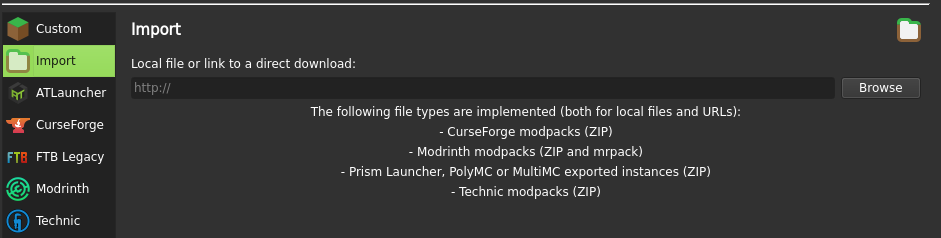
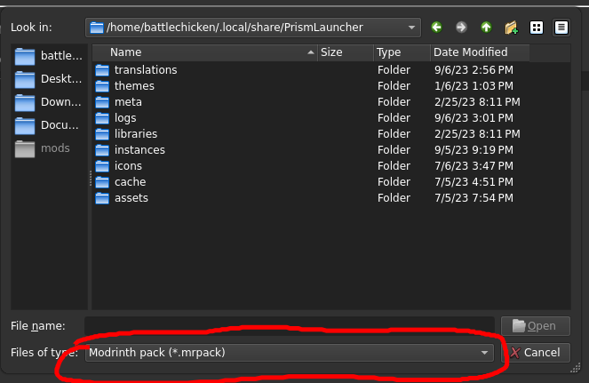

# Bepic Create

Welcome to Bepic Create, a small modpack focused around the create mod.

## Installation

You'll need the following pieces of software installed on your computer:

- [Prism Launcher](https://prismlauncher.org/)
- [Java 17](https://prismlauncher.org/wiki/getting-started/installing-java/)

You'll also need to add a Microsoft account before you can play online. This can be done under `Accounts` -> `Manage Accounts`.

Then you need to download the modpack itself. Download the latest version from the [releases](https://github.com/BattleCh1cken/fabric-modpack/releases). It should be a `.mrpack` file.

Inside Prism Launcher, click on the `file` option in the top left corner. Then select `Add instance`, and then click `Import`.

Browse your files for the modpack, and select it. Make sure your filetype is set to `.mrpack`, and not `.zip`.

Click `Ok`, and you should be good to go!
